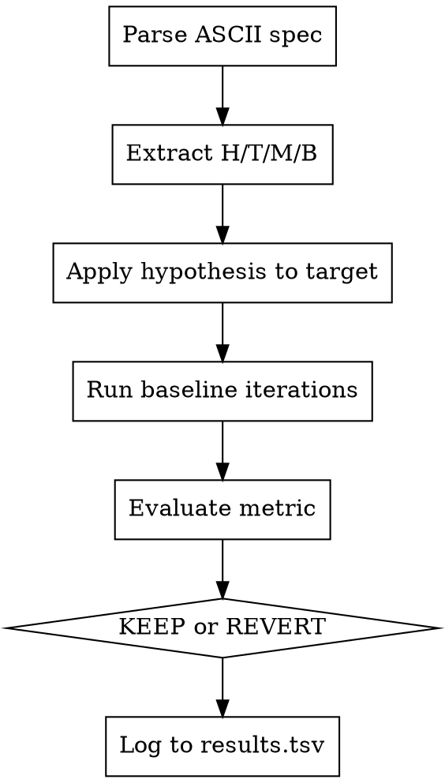

# ASCII-Based Experiment Spec Format Design

> Design document for AutoResearch framework spec format
> Date: 2026-03-22
> Status: Approved

## Executive Summary

Design an ASCII spec format where specs ARE executable programs. AI outputs ASCII naturally, and a fixed runtime executes specs. This aligns with the pxOS philosophy: text IS the program.

## Core Insight

```
AIs output text naturally → ASCII is their native language → specs should BE programs, not describe programs
```

## The Format

### H/T/M/B Keys (Sacred)

| Key | Meaning | Example |
|-----|---------|---------|
| H | Hypothesis | "Cache OP_NAMES lookup for faster dispatch" |
| T | Target file | "sync/synthetic-glyph-vm.js" |
| M | Metric/success criteria | "tests pass" or "ops/sec > 5M" |
| B | Baseline/budget | "100 iterations" or "5m" |

### Layer 0: Minimal (4 lines)

```
H: Use AdamW optimizer
T: train.py
M: val_bpb < 0.7
B: 5m
```

### Layer 1: Boxed

```
┌──────────────────────────────────────────────────┐
│ EXPERIMENT - AI-generated optimization            │
├──────────────────────────────────────────────────┤
│ H: Add a reset method to VMState class            │
│ T: sync/synthetic-glyph-vm.js                    │
│ M: tests pass                                    │
│ B: 100 iterations                                │
└──────────────────────────────────────────────────┘
```

### Layer 2: Flow

```
┌─────────┐     ┌─────────┐     ┌─────────┐     ┌─────────┐
│ HYPOTH  │────▶│ RUN     │────▶│ EVAL    │────▶│ DECIDE  │
│ AdamW   │     │ train   │     │ val_bpb │     │ ?       │
└─────────┘     └─────────┘     └─────────┘     └─────────┘
```

### Layer 3: Full (Box + KV + Flow + History)

```
╔═══════════════════════════════════════════════════════════════╗
║ EXPERIMENT: optimizer-search-001                              ║
╠═══════════════════════════════════════════════════════════════╣
║ SPEC                                                          ║
║ ┌─────────────────────────────────────────────────────────┐  ║
║ │ H: Use AdamW optimizer instead of SGD                   │  ║
║ │ T: train.py                                             │  ║
║ │ M: val_bpb < 0.7                                        │  ║
║ │ B: 5m                                                   │  ║
║ └─────────────────────────────────────────────────────────┘  ║
╠═══════════════════════════════════════════════════════════════╣
║ HISTORY                                                       ║
║ ┌───────┬─────────────┬──────────┬────────┬────────────────┐ ║
║ │ RUN   │ HYPOTHESIS  │ METRIC   │ STATUS │ ACTION         │ ║
║ ├───────┼─────────────┼──────────┼────────┼────────────────┤ ║
║ │ 001   │ SGD         │ 0.89     │ DONE   │ BASELINE       │ ║
║ │ 002   │ AdamW 1e-4  │ 0.71     │ DONE   │ KEEP ✓         │ ║
║ │ 003   │ AdamW 1e-5  │ ???      │ RUN    │ -              │ ║
║ └───────┴─────────────┴──────────┴────────┴────────────────┘ ║
╚═══════════════════════════════════════════════════════════════╝
```

## Design Decisions

1. **H/T/M/B keys are sacred** - Always parse these 4 fields
2. **Boxes are optional** - Runtime handles both boxed and unboxed
3. **History is auto-generated** - Runtime maintains, AI reads
4. **Visual is auto-generated** - Runtime renders metric history
5. **AI only writes SPEC section** - Everything else is derived

## Runtime Behavior

### Execution Flow



### Results Format (TSV)

```tsv
timestamp	hypothesis	baseline	metric	status
1774179103.5822182	Cache opcode names for faster VM dispatch	92	92	KEEP
```

## Integration with ascii_world

### Current Files

| File | Purpose |
|------|---------|
| `.autoresearch/specs/*.ascii` | Experiment specs in Layer 1 format |
| `.autoresearch/results.tsv` | Experiment results log |
| `sync/synthetic-glyph-vm.js` | Target for optimization experiments |

### Parser Implementation

```javascript
class ASCIIExperimentSpec {
  constructor(hypothesis, target, metric, baseline) {
    this.h = hypothesis;  // H: What to try
    this.t = target;      // T: File to modify
    this.m = metric;      // M: Success criteria
    this.b = baseline;    // B: Iterations/budget
  }

  static parse(asciiText) {
    // Extract H/T/M/B from any layer format
    const hMatch = asciiText.match(/H:\s*(.+)/);
    const tMatch = asciiText.match(/T:\s*(.+)/);
    const mMatch = asciiText.match(/M:\s*(.+)/);
    const bMatch = asciiText.match(/B:\s*(.+)/);

    return new ASCIIExperimentSpec(
      hMatch?.[1]?.trim(),
      tMatch?.[1]?.trim(),
      mMatch?.[1]?.trim(),
      bMatch?.[1]?.trim()
    );
  }
}
```

## The Paradigm Shift

**Before:**
```
AI → writes Python → Python runs → logs to TSV → human reads
```

**After:**
```
AI → writes ASCII → ASCII IS the program → runtime renders ASCII → AI reads
```

The AI never writes Python. It writes ASCII specs. The runtime is fixed.

## Connection to pxOS

This format aligns with the AI Native OS analysis:

| AI Native OS Concept | ASCII Spec Format |
|---------------------|-------------------|
| Mirror Layer | The spec box IS the control surface |
| Low-token control | 4 keys (H/T/M/B) control experiments |
| Aries-Taurus model | AI writes hypothesis, runtime executes |
| Transaction elimination | Only changed experiments logged |

The spec box is the "Mirror" - a low-complexity control layer that maps to high-complexity execution.

## Success Criteria

- [ ] Parser handles all 4 layer formats
- [ ] Runtime executes specs from `.autoresearch/specs/*.ascii`
- [ ] Results logged to `.autoresearch/results.tsv`
- [ ] AI can read results and generate new specs
- [ ] Integration with synthetic-glyph-vm.js optimization loop
